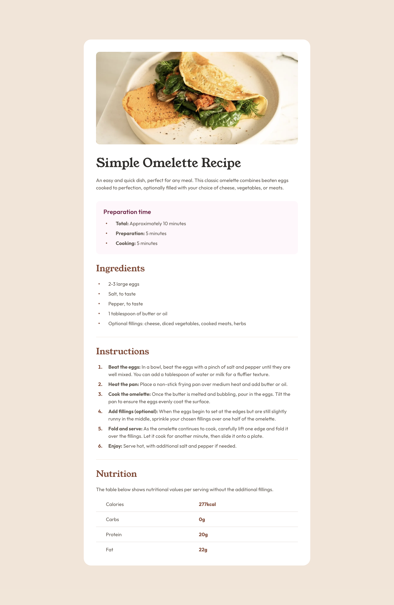

# Frontend Mentor - Recipe page solution

This is a solution to the [Recipe page challenge on Frontend Mentor](https://www.frontendmentor.io/challenges/recipe-page-KiTsR8QQKm). This solution demonstrates a modern, responsive recipe page implementation using React and Next.js, with a focus on accessibility and user experience.

## Table of contents

- [Screenshot](#screenshot)
- [Links](#links)
- [My process](#my-process)
- [Built with](#built-with)
- [Author](#author)

## Screenshot

| Mobile Preview                | Tablet Preview                | Desktop Preview                |
| ----------------------------- | ----------------------------- | ------------------------------ |
|  |  |  |

## Links

- Solution URL: [Add solution URL here](https://your-solution-url.com)
- Live Site URL: [Add live site URL here](https://recipe-page-rouge-alpha.vercel.app)

## Built with

- [React](https://reactjs.org/) - JS library
- [Next.js](https://nextjs.org/) - React framework with App Router
- [TypeScript](https://www.typescriptlang.org/) - For type safety
- [Tailwind CSS](https://tailwindcss.com/) - For utility-first styling
- [Vitest](https://vitest.dev/) - For unit testing
- Semantic HTML5 markup
- Mobile-first responsive design
- Proper SEO setup with metadata

## Author

- Frontend Mentor - [@ardaeker](https://www.frontendmentor.io/profile/ardaeker)
